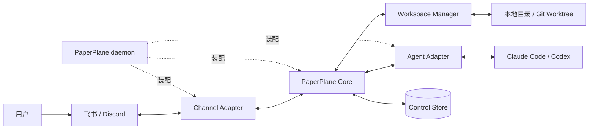

# PaperPlane 目标蓝图

> 让部署者能够从日常协作渠道中，安全、持续地使用运行在自有设备或共享服务器上的 Coding Agent。

## 1. 文档定位

本蓝图定义 PaperPlane 的产品语义、系统边界与架构不变量。

它描述 PaperPlane 应当成为什么，不描述仓库已经实现了什么，也不规定交付日期、实施排序或代码拆分方式。具体实现可以演进，但不应在没有明确设计裁决的情况下改变本文定义的核心心智模型。

## 2. 使命与定位

PaperPlane 是一个开源、自托管、双侧可扩展的 Coding Agent 远程前端。

它运行在部署者控制的宿主上，把飞书、Discord 等协作渠道连接到 Claude Code、Codex 等 Coding Agent。用户可以直接在渠道中创建长期 Session、持续交互、查看进度、处理审批、协作、恢复上下文，并管理 Agent 的运行权限。

执行宿主可以是：

- 个人开发机器；
- 团队共享开发服务器；
- 由部署者控制的其他持续运行环境。

在共享服务器形态下，用户不需要启动个人电脑，也不需要在本机安装 Agent。仓库、Git worktree、Agent Runtime、原生会话数据和 PaperPlane 控制状态都位于团队自行管理的服务器上。

PaperPlane 不实现 Coding Agent，也不替代 Agent 自身的推理、工具和上下文能力。它负责统一不同渠道与不同 Agent 之间的 Session、安全、权限、协作和可靠性语义。

PaperPlane 不提供由官方运营、用户直接注册使用的 Agent SaaS。

## 3. 核心心智模型

PaperPlane 最重要的产品关系是：

```text
渠道中的 Topic / Thread
              ║
              ║ 永久一对一
              ║
      PaperPlane Session
              ║
              ║ 一个当前运行映射
              ║
 Claude / Codex Native Session
```

### 3.1 Topic / Thread 就是 Session

在飞书中，Topic 是 Session 的用户界面；在 Discord 中，Thread 承担同样的职责。

- 一个 Topic/Thread 永久对应一个 PaperPlane Session。
- 一个 PaperPlane Session 永远不会重新绑定到另一个 Topic/Thread。
- 一个 Topic/Thread 也不会被重新用于另一个 PaperPlane Session。
- PaperPlane 使用独立、稳定的 `session_id`，不直接把渠道 ID 当作领域主键。
- 渠道地址被删除或失效后，原映射仍然保留，Session 进入不可连接状态，而不是静默换绑。
- Agent Runtime 可以崩溃、重启、恢复或重建，但 PaperPlane Session 和渠道地址保持不变。

不存在把整个私聊或群聊绑定为“当前 Session”的替代模型。进入对应 Topic/Thread，就是进入对应 Session。

### 3.2 父聊天是控制面

飞书私聊、飞书群聊或 Discord Channel 是 Parent Conversation，只承担：

- 显式创建 Session；
- 发现和查找已有 Session；
- 查看 Session 状态；
- 进入对应 Topic/Thread；
- 执行部署级或会话级管理操作。

父聊天中的普通消息不会被解释为某个 Session 的 prompt。

### 3.3 Topic / Thread 是工作面

所有与 Agent 工作直接相关的交互都发生在 Session 对应的 Topic/Thread 中：

- 发送 prompt；
- 查看进度和最终结果；
- 处理审批；
- 继续多轮交互；
- 管理 Collaborator；
- 中断当前 Turn；
- 调整可变运行参数；
- 归档或恢复 Session。

只有通过 PaperPlane 创建并登记的 Topic/Thread 才是 Session。用户手工创建的普通话题不会被自动接管。

如果一个渠道无法可靠创建和寻址独立的 Topic/Thread，它就不能实现完整的 PaperPlane Channel 契约。PaperPlane 不会用普通聊天绑定来替代这一语义。

## 4. 完整产品体验

### 4.1 创建 Session

用户在 Parent Conversation 中显式创建 Session：

```text
私聊：/new
群聊：@PaperPlane /new
```

创建过程可以通过命令参数、交互卡片或渠道原生交互收集：

- Agent 类型；
- Workspace 来源；
- 权限档位；
- 模型、思考强度等可选参数；
- 初始 Collaborator。

PaperPlane 完成身份和策略检查后：

1. 创建稳定的 PaperPlane Session；
2. 校验或准备 Workspace；
3. 创建渠道 Topic/Thread；
4. 启动或连接 Agent Runtime；
5. 持久化各对象之间的映射；
6. 在 Topic/Thread 中发布 Session 状态。

任何一步失败都必须产生可恢复、可诊断的状态，不能留下无法识别的孤儿 Topic、worktree 或 Agent 进程。

### 4.2 渠道触发规则

飞书私聊中，经过授权的用户可以直接向 Bot 发送消息。

飞书群聊及群 Topic 中，只有明确 `@bot` 的消息才会进入 PaperPlane：

- mention 必须依据飞书事件中的结构化信息判断；
- 不能只依赖文本中是否出现 `@` 字符；
- 未 mention Bot 的消息全部静默忽略；
- 群成员可以继续在 Topic 中进行不触发 Agent 的人类讨论。

Discord 等其他渠道由 Adapter 提供等价的明确触发语义。

### 4.3 多轮工作

Session 中的普通输入会被提交给其固定 Agent 和 Workspace。

Turn 运行时，PaperPlane 展示：

- 当前运行状态；
- 重要工具调用；
- 文件或环境变更；
- 关键输出摘要；
- 审批等待状态；
- 最终结果和可用的资源统计。

支持消息编辑的渠道可以持续更新同一条进度消息；不支持编辑的渠道可以采用受控的等价展示，但不能改变 Session 和 Turn 语义。

进度展示可以合并和节流，最终结果必须形成稳定、可回看的消息。

### 4.4 运行中输入

一个 Session 同一时刻最多只有一个活跃 Turn，不同 Session 可以并行运行。

活跃 Turn 期间收到新 prompt 时，PaperPlane 必须明确呈现可用处理方式：

- 排队到当前 Turn 之后；
- steer 当前 Turn；
- 中断当前 Turn 后执行新输入；
- 取消本次输入。

实际选项由 Agent Capability、Channel Capability 和 Host Policy 共同决定。不支持的能力不应显示，也不能用近似行为冒充。

### 4.5 生命周期

PaperPlane 区分 Turn、Agent Runtime 和 Session 的生命周期：

- `/interrupt`：只中断当前 Turn，Session 继续存在；
- `/archive`：归档 Session，停止接收新的普通 prompt，保留 Topic 和历史；
- `/resume`：在原 Topic/Thread 中恢复 Session；
- Agent Runtime 崩溃：不删除 Session；
- daemon 重启：不改变 Session 身份；
- 渠道断线：不自动终止已经开始的 Turn；
- 聊天命令不提供物理删除 Session 的能力。

真正的破坏性删除只能由 Host Admin 通过明确的宿主管理操作完成，并进入审计记录。

## 5. 核心领域模型

### 5.1 Deployment 与 Host

Deployment 是一套正在运行的 PaperPlane。

Host 是实际承载下列资源的机器：

- PaperPlane daemon；
- Agent Runtime；
- 仓库和 Git worktree；
- Agent 原生会话数据；
- PaperPlane Control Store。

本蓝图以一个 Deployment 对应一个 Host 为系统边界。同一 Host 可以并行承载多个 Session。

多 Host 统一编排不属于本文定义的系统形态。引入该能力需要独立裁决其信任边界、路由、协调和故障语义；本文不为它预埋中心 relay 或分布式调度抽象，也不将它列为永久排除的能力。

### 5.2 Parent Conversation

Parent Conversation 是渠道中的父级会话，例如飞书私聊、飞书群聊或 Discord Channel。

它提供 Session 的创建、发现和管理入口，但不承载任何 Session 的默认 prompt 路由。

### 5.3 Session Container

Session Container 是可独立创建、寻址和返回的 Topic/Thread。

其渠道地址至少能够表达：

```text
channel
parent conversation
topic/thread identifier
```

它是 PaperPlane Session 的永久渠道位置。

### 5.4 PaperPlane Session

Session 是最重要的领域对象，至少包含：

```text
session_id
channel session address
host
agent type
workspace
owner
collaborators
permission profile
lifecycle state
native agent session reference
effective capabilities
```

创建后永久固定：

- Topic/Thread 地址；
- Host；
- Agent 类型；
- Workspace；
- Owner。

可以调整：

- Collaborator；
- 模型；
- 思考强度；
- 权限档位；
- 展示和通知偏好；
- Adapter 明确声明可动态调整的其他参数。

### 5.5 Workspace

每个活跃 Session 使用一个固定工作目录。

Workspace 可以来自：

- 已存在且经过 Host Policy 授权的本地目录；
- PaperPlane 为指定仓库和分支创建的独立 Git worktree。

自动创建的 worktree 默认由对应 Session 独占。已有目录也不能被多个不兼容的活跃 Session 意外共享。

Session 存续期间不能更换 Workspace。需要使用其他目录时，应创建新的 Session。

Workspace Manager 负责校验、登记和维护 Workspace，但不承担仓库托管、通用依赖安装或通用容器编排。

### 5.6 Agent Runtime

Agent Runtime 是 Session 当前连接的 Claude Code、Codex 或其他 Agent 运行实例。

一个 Session 在任意时刻最多连接一个当前 Runtime。Runtime 可以被恢复或重建；PaperPlane 保存当前 native session reference 及必要的历史关联，但不因此创建新的 PaperPlane Session。

### 5.7 Turn

Turn 表示一次从用户输入开始，到完成、失败或中断为止的 Agent 工作过程。

Turn 可以处于：

```text
queued
running
awaiting_approval
completed
failed
interrupted
```

一个 Turn 的失败不会导致 Session 消失。

### 5.8 Approval

Approval 必须绑定到：

```text
Session + Turn + Tool Request + Owner
```

它具有明确状态：

```text
pending
approved
denied
expired
cancelled
```

Approval 只能消费一次。Turn 中断、Agent 撤销请求、Session 归档或超时都会使其失效。

## 6. 系统架构

PaperPlane 采用端口与适配器结构。Core 定义统一产品语义，渠道和 Agent 分别实现契约，App 负责装配和进程生命周期。



### 6.1 Channel Adapter

Channel Adapter 负责把协作平台归一化为 Parent Conversation 和 Session Container 语义。

必备职责：

- 建立和维护渠道连接；
- 提供稳定的用户身份；
- 识别 Parent Conversation、Topic/Thread 和 mention；
- 创建并寻址 Session Container；
- 接收 Topic/Thread 内的消息和交互动作；
- 发送、回复和更新消息；
- 提供稳定的入站事件 ID；
- 安全处理卡片、按钮或等价交互；
- 报告连接与恢复状态；
- 声明 Capability。

Channel Adapter 不解释 Agent 协议，不管理 Workspace，也不决定成员权限。

### 6.2 Agent Adapter

Agent Adapter 负责把 Coding Agent 归一化为 Session Runtime 和 Turn 语义。

必备职责：

- 创建 native session；
- 恢复 native session；
- 提交 prompt；
- 中断 Turn；
- 输出统一事件流；
- 报告 Runtime 和 Turn 状态；
- 映射权限档位；
- 暴露审批请求并接收决策；
- 声明 Capability。

可选能力包括 steer、fork、模型切换、思考强度、Skills、费用统计、文件或图片输入以及 Agent 特有操作。

Agent Adapter 不接触渠道消息，不决定 Owner 或 Collaborator 权限，也不渲染渠道 UI。

### 6.3 PaperPlane Core

Core 是唯一的业务语义层，负责：

- Session 注册、查找和生命周期；
- Topic/Thread 与 Session 的永久映射；
- Parent Conversation 控制操作；
- Owner 和 Collaborator 授权；
- Turn 串行化、排队、steer 和 interrupt；
- 权限档位与审批状态机；
- Workspace 安全策略和生命周期；
- Channel 与 Agent Capability 协商；
- Agent 事件到统一展示模型的转换；
- 进度节流、最终结果与通知；
- 渠道断线缓冲、幂等、重试和恢复；
- 控制状态持久化与审计。

Core 不导入飞书、Discord、Claude、Codex 或其他平台 SDK 类型。

### 6.4 Workspace Manager

Workspace Manager 负责：

- 校验已有目录是否位于允许根目录；
- 使用 canonical path 防止符号链接逃逸；
- 创建和登记 Git worktree；
- 防止意外共享 Workspace；
- 维护 worktree 与 Session 的关联；
- 按明确策略保留或回收受管 Workspace；
- 记录所有创建、复用和清理操作。

归档不应默认等同于丢弃 Workspace。任何可能影响恢复或未提交变更的回收操作，都必须受 Host Policy 控制并可审计。

### 6.5 Control Store

Control Store 保存 PaperPlane 自己拥有的控制面状态。

Core 面向存储契约，不把业务规则绑定到具体数据库。

### 6.6 App / daemon

App 是 Composition Root，负责：

- 加载和校验配置；
- 创建 Store、Core、Workspace Manager 和 Adapter；
- 执行数据迁移；
- 启动、停止和健康检查；
- 处理进程信号；
- 管理结构化日志和运行诊断。

App 不实现 Session、审批或消息路由规则。

### 6.7 依赖方向

```text
app
 ├── channel-* ─┐
 ├── agent-* ───┼──→ core contracts
 └── store-* ───┘
```

- Core 定义契约；
- Adapter 实现契约；
- App 选择并装配实现；
- Channel Adapter 与 Agent Adapter 不直接依赖；
- 任意符合契约的渠道和 Agent 可以组合。

## 7. 安全与信任模型

PaperPlane 能够远程驱动宿主执行代码，因此安全属于核心产品语义。

### 7.1 角色

| 角色 | 权限边界 |
| --- | --- |
| Host Admin | 管理部署配置、Agent、Workspace Root、资源限制和可用权限档位 |
| Session Owner | 管理自己的 Session、审批、权限、成员和生命周期 |
| Collaborator | 在获邀 Session 中提交 prompt 并参与允许的 Turn 操作 |
| Observer | 只能查看渠道本身允许其查看的内容 |

Host Admin 是宿主可信边界的一部分。PaperPlane 不试图对 Host Admin 提供强隔离。

### 7.2 双层授权

一个用户能够操作 Session，需要同时满足：

1. 部署级身份与准入策略；
2. Session 级 Owner 或 Collaborator 角色。

加入群聊或能够查看 Topic，不会自动获得 PaperPlane 权限。Owner 邀请 Collaborator 也不能绕过 Host Policy。

所有授权都必须由 Core 校验，不能把按钮是否可见当作权限控制。

### 7.3 Session 权限

| 操作 | Owner | Collaborator |
| --- | ---: | ---: |
| 发送 prompt | 是 | 是 |
| 排队或 steer | 是 | 是 |
| 中断当前 Turn | 是 | 可配置，默认否 |
| 处理审批 | 是 | 否 |
| 修改权限档位 | 是 | 否 |
| 邀请或移除成员 | 是 | 否 |
| 归档或恢复 Session | 是 | 否 |
| 改变 Host、Agent 或 Workspace | 否 | 否 |

Owner 是 Session 的稳定属性，不通过普通渠道操作转移。

### 7.4 渠道入口安全

- 私聊只处理经过部署授权的用户；
- 群聊和群 Topic 必须明确 mention Bot；
- 未授权消息静默忽略，不暴露宿主状态；
- 身份判断使用渠道稳定用户 ID，不依赖昵称；
- 重复、乱序和过期事件均按不可信输入处理。

### 7.5 Workspace 安全

- Workspace 必须位于 Host Admin 允许的根目录；
- 路径校验基于真实路径，而不是字符串前缀；
- 符号链接不能用于逃逸允许范围；
- Session 不能通过后续 prompt 或控制命令改绑 cwd；
- worktree 创建、复用、归档和回收全部可审计。

### 7.6 凭证与审计

- Bot Secret、Agent Token 和其他凭证不进入仓库或普通日志；
- 凭证来自受控配置、环境变量或 Secret Provider；
- 本地敏感配置执行严格权限检查；
- 审计记录 Actor、时间、Session、Turn、动作和权限变化；
- 是否保存完整 prompt 内容由部署者配置；
- 默认优先保存必要元数据，减少敏感数据复制；
- 审计日志不保存凭证或隐藏 Agent 上下文。

## 8. 权限档位与审批

PaperPlane 负责统一选择、保存、展示并验证 Session 的实际执行权限。它不强制所有 Session 都逐次审批。

### 8.1 统一权限档位

| 权限档位 | 产品语义 |
| --- | --- |
| `plan` | 只分析，不执行修改性操作 |
| `ask` | 需要额外授权时向 Owner 发起审批 |
| `workspace-autonomous` | 在固定 Workspace 边界内自主执行，不获得任意宿主访问 |
| `full-access` | 无沙箱限制且无逐次审批，Agent 可以直接操作宿主 |
| Adapter 扩展档位 | 只有能够准确表达并展示实际语义时才可提供 |

Agent Adapter 将统一档位映射到 Agent 原生设置。例如，`full-access` 可以映射到 Claude Code 的危险权限绕过模式，或 Codex 的无沙箱、永不询问组合。

### 8.2 实际策略必须与界面一致

PaperPlane 不应额外制造隐藏审批，但必须防止界面与底层策略不一致：

- UI 显示 `ask` 时，Agent 不能因本地 Allow Rule 静默自动放行；
- UI 显示 `full-access` 时，PaperPlane 不再插入逐次审批；
- Adapter 无法准确保证某个档位时，必须声明不支持；
- 不允许用“接近”的原生设置静默替代统一语义。

Host Admin 可以禁用任意高风险档位，包括全局禁用 `full-access`。

只有 Owner 能修改 Session 权限。变更的发起者、生效值和时间必须进入审计，界面必须持续显示实际生效的档位。

### 8.3 审批安全

每个审批请求至少绑定：

```text
session_id
turn_id
request_id
owner_id
tool or action
expiration
```

审批决策必须：

- 只能由 Owner 作出；
- 只能消费一次；
- 校验 Session、Turn 和请求仍然有效；
- 在 Agent 撤销、Turn 中断或 Session 归档后立即失效；
- 超时后默认拒绝；
- 更新原交互状态，不能留下仍可点击的旧按钮；
- 回传给正确的 Agent Runtime 和请求。

## 9. 持久化边界

Agent 原生存储负责完整对话上下文与恢复。

PaperPlane Control Store 只保存控制面状态，包括：

- Session 及其稳定属性；
- Topic/Thread 地址；
- Owner 和 Collaborator；
- Workspace 与 worktree 信息；
- Agent native session reference；
- 权限档位和有效 Capability；
- Session、Turn 和 Approval 状态；
- 渠道消息引用；
- 入站事件去重记录；
- 待发送事件和投递状态；
- 必要的恢复信息；
- 操作审计。

PaperPlane 不复制完整 Agent Transcript、隐藏上下文或大段工具输出，不成为第二套对话权威数据库。

为了断线恢复而暂存的投递事件属于有限控制缓冲，不改变这一持久化边界。

## 10. 可靠性与恢复

### 10.1 独立状态机

Session、Turn、Approval 和消息投递分别维护状态：

```text
Session:
active ↔ suspended
active ↔ archived
active/suspended → detached

Turn:
queued → running → awaiting_approval
running/awaiting_approval → completed / failed / interrupted

Approval:
pending → approved / denied / expired / cancelled

Delivery:
pending → sent
pending/failed → retrying → sent / failed
```

一个对象的故障不应被错误解释为其他对象已经消失。

### 10.2 入站幂等

渠道可能因为网络重试、断线恢复或响应超时，重复投递同一个消息或按钮事件。

PaperPlane 对稳定的 event/message/action ID 只产生一次业务效果：

- 同一个 `/new` 事件重复送达，只创建一个 Session、一个 Topic 和一个 Agent Runtime；
- 同一个审批动作重复送达，只消费一次审批；
- 用户主动再次发送的新消息具有新的 ID，仍然被视为新的操作。

PaperPlane 追求的是幂等业务效果，而不是假设外部渠道能够保证恰好投递一次。

### 10.3 出站可靠性

Agent 事件转换为统一事件后进入本地待发送队列：

- 进度更新可以合并，只保留最新状态；
- 最终结果、审批、错误和生命周期通知不能被合并丢失；
- 渠道恢复后按 Session 和 Turn 顺序补发；
- 发送成功后保存渠道 Message ID；
- 重试使用稳定幂等键，避免重复终稿或审批卡片。

### 10.4 daemon 重启

启动后 PaperPlane：

1. 加载所有未完成控制状态；
2. 恢复 Session、Topic、Workspace 和权限信息；
3. 根据 Agent Capability 尝试恢复 native session；
4. 核对未完成 Turn 的实际状态；
5. 重发尚未投递的重要事件；
6. 将无法自动恢复的 Session 标记为 `suspended` 并在原 Topic 说明原因。

在状态不明确时，不能自动重复提交原 prompt。

### 10.5 Agent 故障

Agent Runtime 崩溃时：

- 当前 Turn 进入失败或中断状态；
- Session、Topic 和 Workspace 保持不变；
- Adapter 尝试使用 native session reference 恢复；
- 无法自动恢复时，Session 进入 `suspended`；
- Owner 可以在原 Topic 中执行恢复。

### 10.6 渠道断线

- 已经开始的 Turn 默认继续运行；
- Agent 事件进入有界本地缓冲；
- `ask` 模式遇到审批时暂停等待，超时后拒绝；
- `full-access` 模式继续按已经选择的权限执行；
- 缓冲超过安全上限时中断当前 Turn；
- 重连后向原 Topic 补发摘要、最终结果和重要状态。

### 10.7 Topic / Thread 不可用

Topic 被删除、Bot 被移除或渠道权限被撤销时：

- Session 进入 `detached` 或 `suspended`；
- 原渠道映射仍然保留；
- Session 不会静默绑定到其他 Topic；
- Workspace、native session reference 和控制状态继续保存；
- 正在运行的 Turn 默认中断，避免在完全失去控制面的情况下继续执行；
- Host Admin 可以在宿主上检查、归档或导出状态。

### 10.8 资源与背压

Host Policy 可以限制：

- 活跃 Session 数；
- 并行 Turn 数；
- Agent 进程数；
- 缓冲事件数量和磁盘占用；
- 单条消息、工具输出和附件大小；
- 审批等待时间；
- Session 空闲时间；
- worktree 保留条件。

达到限制时必须明确排队或拒绝，不能静默丢弃输入或输出。

## 11. 双侧扩展与 Capability

双侧可扩展是 PaperPlane 的核心架构属性：

```text
Channel Adapter ← PaperPlane Core → Agent Adapter
```

### 11.1 Channel Capability

完整 Channel Adapter 必须支持：

- 稳定用户身份；
- Parent Conversation；
- 可独立寻址的 Topic/Thread；
- 创建 Session Container；
- 接收 Session 内消息；
- 发送 Session 消息；
- 安全交互及操作者身份；
- 稳定入站事件 ID；
- 连接和恢复状态。

可选能力包括：

- 原地编辑消息；
- 富文本卡片；
- 文件和图片；
- 原生命令；
- Reaction；
- Topic 成员管理；
- 消息引用；
- 渠道侧搜索。

缺少富卡片时可以使用等价文本交互；缺少独立 Session Container 时不能被认定为完整支持。

### 11.2 Agent Capability

基础 Agent 能力包括：

- 创建和恢复 native session；
- 提交 prompt；
- 中断 Turn；
- 统一事件流；
- Runtime 状态；
- 权限策略映射；
- 审批请求与决策回填。

可选能力包括：

- steer；
- fork；
- 模型切换；
- 思考强度；
- Skills；
- 用量与费用；
- 文件或图片输入；
- Agent 特有操作。

### 11.3 Capability 协商

创建 Session 时，Core 计算：

```text
Channel Capabilities
∩ Agent Capabilities
∩ Host Policy
= Session Effective Capabilities
```

例如：

- Agent 不支持 steer，就不展示 steer；
- Channel 不支持消息编辑，就采用受控的进度展示；
- Host 禁用 `full-access`，即使 Agent 支持也不提供；
- Agent 无法准确映射某个权限档位，就不能提供该档位。

Capability 必须来自 Adapter 的真实 API、初始化响应或运行探测，不能由 Core 根据产品名称或版本字符串猜测。

### 11.4 Adapter 交付契约

官方和第三方 Adapter 都应作为独立包提供：

- 名称和 Adapter 版本；
- 配置 Schema；
- Capability 声明；
- Core 契约实现；
- 错误映射；
- 健康检查；
- 契约符合性测试。

Core 提供可复用的 Conformance Suite。Adapter 声明支持的每项 Capability 都必须有对应行为验证；不支持必须明确声明，不能直到运行时才以未知错误失败。

## 12. 部署与宿主管理

部署配置至少描述：

- Host 身份；
- Channel Adapter 及凭证来源；
- Agent Adapter 及认证方式；
- 用户准入策略；
- 允许的 Workspace Root；
- 可用权限档位；
- Session、Turn 和 Agent 并发限制；
- 缓冲、审计和 worktree 保留策略；
- Adapter 特有配置。

配置必须经过 Schema 校验。敏感值可以来自环境变量或外部 Secret Provider，不要求写入明文文件。

Host Admin 需要能够：

- 查看 daemon、Channel 和 Agent 健康状态；
- 查看活跃、暂停、分离和归档 Session；
- 查看资源使用与缓冲积压；
- 终止失控的 Turn 或 Runtime；
- 禁用 Adapter 或权限档位；
- 检查和处理 detached Session；
- 管理 worktree 保留和清理；
- 导出必要的诊断与审计信息。

这些能力可以通过 CLI、Web 或其他宿主管理界面提供；蓝图不限定具体交互载体。

## 13. 质量目标

PaperPlane 的实现应持续满足：

- **语义一致**：不同 Channel × Agent 组合共享同一 Session 心智模型；
- **安全明确**：用户看到的权限档位与 Agent 实际策略一致；
- **身份稳定**：Runtime 或渠道故障不改变 Session 身份；
- **可恢复**：daemon、渠道或 Agent 故障不会破坏可恢复控制状态；
- **幂等可靠**：重复和乱序事件不会产生重复业务效果；
- **资源有界**：进程、并发、缓冲和磁盘使用有明确限制；
- **可审计**：关键远程操作能够关联到用户、Session 和 Turn；
- **可观测**：故障能够定位到渠道、Core、Agent、Workspace 或投递层；
- **可验证**：状态机、权限映射和 Adapter Capability 具有自动化测试；
- **边界清晰**：渠道 SDK 和 Agent SDK 类型不泄漏进 Core。

一个 Channel × Agent 组合只有能够闭合以下链路时，才能被认定为完整支持：

```text
显式创建 Session
→ 创建独立 Topic/Thread
→ 固定 Agent 与 Workspace
→ 多轮 Turn
→ 进度与最终结果
→ 权限档位与审批
→ Collaborator 授权
→ 中断、归档与恢复
→ 故障后返回原 Topic/Thread
```

## 14. 永久边界

PaperPlane 永久不承担：

- 自研或训练 Coding Agent；
- 由 PaperPlane 官方运营、用户直接注册使用的 Agent SaaS；
- 成为 Agent 完整 Transcript 的第二套权威存储；
- 成为通用即时通讯机器人开发框架；
- 替代 Git 托管平台；
- 替代 CI 系统；
- 成为通用容器编排平台。

个人机器和团队共享服务器都属于自托管形态。共享服务器上的集中执行是完整目标能力，不等于官方托管服务。

多 Host 统一编排不属于本文定义的系统形态，也不是永久非目标。引入该能力需要重新裁决其信任边界、路由、协调和故障语义。

## 15. 蓝图不变量摘要

1. Topic/Thread 与 PaperPlane Session 永久一对一。
2. Parent Conversation 只提供控制面，不承载默认 Session。
3. Session 创建必须通过显式 `/new`。
4. Session 的 Host、Agent、Workspace、Owner 和渠道地址创建后固定。
5. Session 内 Turn 串行，不同 Session 可以并行。
6. 群聊和群 Topic 只有明确 mention Bot 才触发。
7. Session 采用 Owner 与显式 Collaborator 权限模型。
8. `full-access` 是正式权限档位，启用后真实跳过逐次审批。
9. Agent 保存完整上下文，PaperPlane 保存控制面状态。
10. 渠道断线不等于 Agent 自动停止。
11. Runtime 消失不等于 Session 消失。
12. Channel 和 Agent 两侧都通过稳定契约与 Capability 扩展。
13. 计算和数据位于部署者控制的个人机器或共享服务器。
14. PaperPlane 不提供官方 Agent SaaS。
